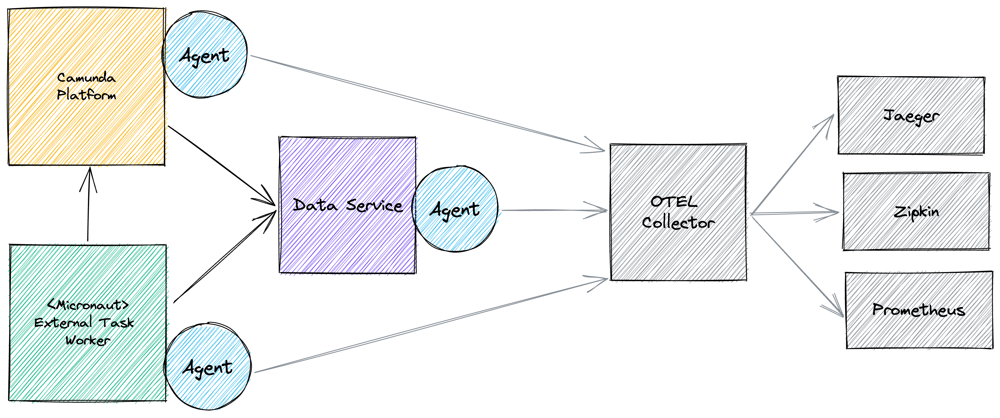

# Camunda + Open APM  <!-- omit in toc -->

A small demo to show how you can monitor Camunda and the surrounding systems with Open Source Application Performance Management (APM) tools ([openapm.io](https://openapm.io)).

The landscape we use:

## Table of Contents <!-- omit in toc -->

- [✨ Features](#-features)
- [🚀 Getting Started](#-getting-started)
- [🏛 Architecture](#-architecture)

## ✨ Features

- Grafana Dashboard, e.g. http://localhost:3001/  
  You could log in as User with **username** `admin` and **password** `demo`

- Jaeger UI: http://localhost:16686/

You can start the Camunda example process manually via the Camunda [Tasklist](http://localhost:7777/camunda/app/tasklist/), login as user with **username** `admin` and **password** `pw`.

The process contains a service task which calls an external service.

## 🚀 Getting Started

To start the docker container run `docker-compose up`.

## 🏛 Architecture

.

The image shows all components and how they communicate with each other. The [Camunda Platform Engine](./camunda-plattform-engine/) uses a [JavaDelegate]() to fetch data from the [Data Service](./external-service/). The [Mirconaut External Task Worker](./micronaut-client/) fetches task from the engine and loads data from the Data Service and store some information back to the engine.

To monitor all these components and their interactions I added a inspectIT Ocelot,  a JavaAgent, to each docker container they are running in. This Agent collects as much Infomaiton as you want using APM Tools like Jaeger, Grafana or Prometheus you could monitor and analyze them.
